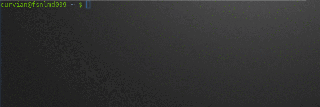

# iota-utils
**genseed** - a simple script that safely generates an IOTA seed from a linux terminal.  





genseed generates an 81-character seed for use with IOTA wallets by default. The generated 
seed is either printed to stdout or copied to clipboard and automatically removed after some 
seconds (unless `--show` option is used) 
\- see script for defaults.


#### Bash command
If you're just looking for a bash command to generate a seed:    

```bash
< /dev/urandom tr -dc A-Z9 | head -c 81;echo
```  

**urandom info**  
https://www.2uo.de/myths-about-urandom/


### Install
Copy `genseed` anywhere to a location in your PATH (or else run with `./genseed`).  
Make sure it's executable: `chmod +x genseed`   

Tested on bash (and dash) on Gentoo, Arch and Ubuntu.  
 

### Usage

`genseed --help`  


```
Usage: genseed [options]

Options:
  --size          Specify seed size (current default: 81)
  --charset       Characterset to use for seed generation (current default: A-Z9)
  --wait          Time in seconds to wait before nuking (current default: 21)
  --copy          Copy seed to clipboard and remove after 21 seconds (needs xsel)
  --show          Outputs the seed in clear text to stdout and nothing else
  --help          Print this help message

Examples:
  Generate seed:
      genseed
  Generate seed for other than IOTA use:
      genseed --size=32 --charset=A-Z0-9~_
  Generate and copy seed to clipboard:
      genseed --copy
  Just print my seed, man:
      genseed --show

```


### Clipboard Operations  
 - genseed uses xsel for clipboard operations (copy and clear).
 - Use `genseed --help` to check if it is installed (warning at bottom if not installed).
 - If xsel is not installed, clipboard will not be used.
 - If genseed used over remote login (ssh), clipboard operations will not work.
 - Of CLIPBOARD, PRIMARY and SECONDARY selections, CLIPBOARD is used.
