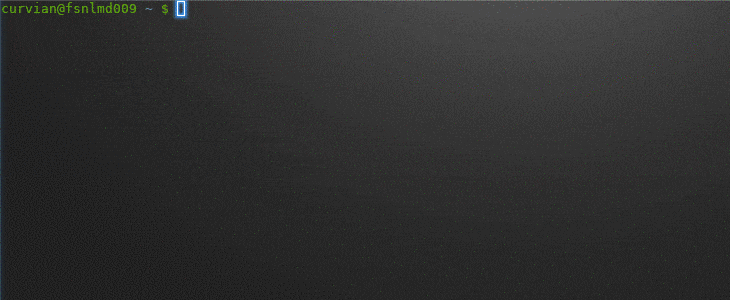

# iota-utils
**nodeq** - quickly query iota nodes  





Written in BASH ~(POSIX compliant)~, Does not work with DASH.  

Uses jq for nice output. If jq is not installed, Python's json.tool module will be used.  

Able to paste output to online paste bin.  


### install ###

Copy it to a location on your path for convenient access.  

Make it executable:

`chmod +x nodeq` 


### usage ###


`nodeq --help`  


```
Usage: nodeq command [command-arg] [options]

Commands:
  1|getNodeInfo                       Get node info
  2|getNeighbors                      Get neighbor info
  3|addNeighbors <neighbor>           Add neighbor
  4|removeNeighbors <neighbor>        Remove neighbor

Options:
  --node-uri      Specify node uri
                  example: --node-uri=http://192.168.1.1:14600
                  (default: change it to your liking at top of this script)
  --basic-auth    Http basic auth credentials, if required by the node
                  example: --basic-auth=user:password
                  (default: change it to your liking at top of this script)
  --paste         Paste result to remote paste bin (dpaste)
  --paste-noob    Paste result to remote paste bin (dpaste)
                  Same as --paste but does not hide addresses and sets
                  expire to 'once off' (expires after first view)
  --help          Print this help message

Examples:
  Get neighbours:
      nodeq 2
      or:
      nodeq getNeighbors
  Get node info and paste results to paste bin:
      nodeq 1 --paste
      or:
      nodeq getNodeInfo --paste
  Get neighbours from a node other than default setting:
      nodeq 2 --node-uri=http://some.other.node:31415

```
